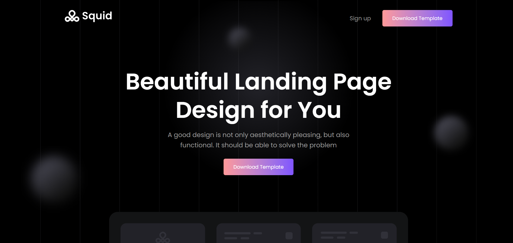
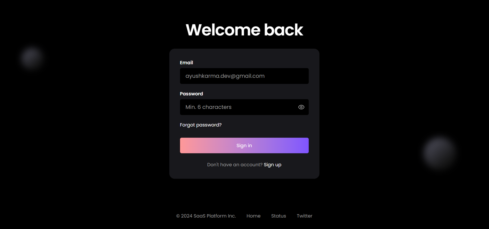
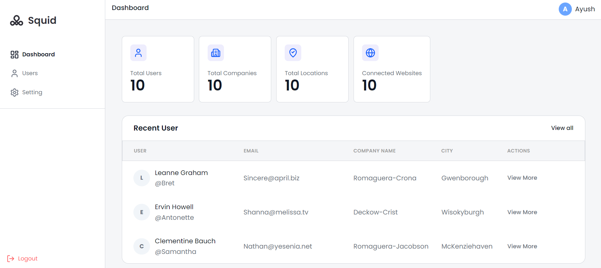
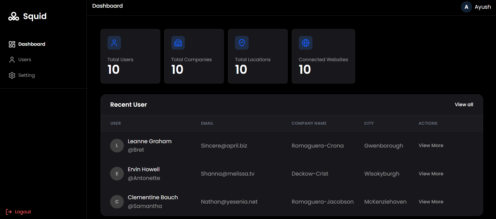
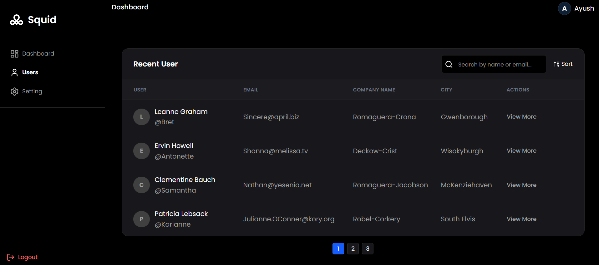
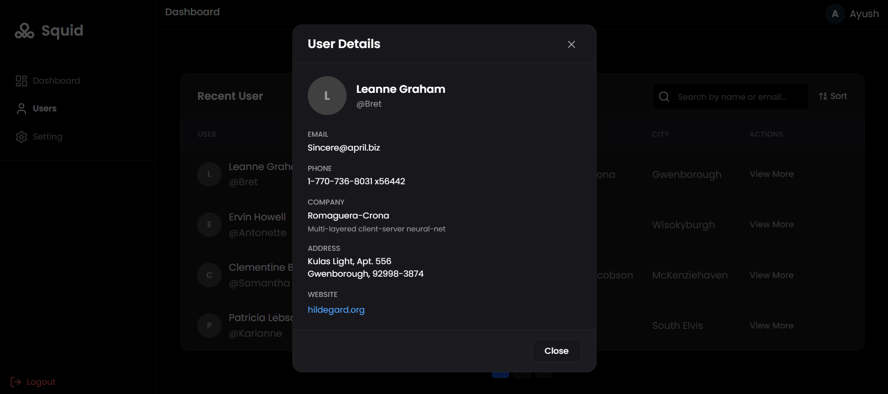

# Squid - SaaS Landing & Dashboard

A type-safe web application built with **React**, **TypeScript**, and **Tailwind CSS** for the MERN Frontend Shortlisting Project. Features a pixel-perfect Figma landing page, user authentication, and a fully functional dashboard with API integration.


> **Note:** This is a web-only application optimized for desktop browsers.

## 📝 Project Overview

This project consists of three main parts:

- **Part A:** Pixel-accurate landing page following the provided Figma design
- **Part B:** Authentication system (login/signup)
- **Part C:** Dashboard with JSONPlaceholder API integration

---

## 📋 Table of Contents

- [Features](#-features)
- [Tech Stack](#-tech-stack)
- [Project Structure](#-project-structure)
- [Setup Instructions](#-setup-instructions)
- [Screenshots](#-screenshots)
- [Design Decisions & Tradeoffs](#-design-decisions--tradeoffs)

---

## ✨ Features

### Part A: Landing Page (Figma Match)

- [x] Pixel-accurate homepage following Figma design
- [x] Exact layout, spacing, and typography from design
- [x] Hero section with gradient effects
- [x] Feature showcase section
- [x] Companies/Partners section
- [x] Guide/How-it-works section
- [x] Contact form section
- [x] Responsive navigation
- [x] Footer with social links
- [x] Hover and focus states on interactive elements

### Part B: Authentication

- [x] User login with email
- [x] User registration with form validation
- [x] Protected routes (redirect to login if not authenticated)
- [x] Session persistence with localStorage
- [x] Logout functionality
- [x] Password visibility toggle
- [x] Token-based authentication (fake auth for demo)

### Part C: Dashboard Features

#### Dashboard Summary Page

- [x] Overview with statistics cards
  - Total users count
  - Total companies count
  - Total locations count
  - Connected websites count
- [x] Recent users preview
- [x] Quick navigation to all sections

#### Users Page (Core Feature)

- [x] User list with clean table layout
- [x] Search functionality (by name and email)
- [x] Sort users alphabetically (A-Z, Z-A)
- [x] Client-side pagination (4 users per page)
- [x] User detail modal with complete information
- [x] Click outside modal to close
- [x] API integration with JSONPlaceholder

#### Settings Page

- [x] Dark mode / Light mode toggle
- [x] Theme persistence across sessions
- [x] Settings saved in localStorage
- [x] Profile placeholder section

### Code Quality & UI/UX

- [x] Modern web application design (optimized for desktop)
- [x] Smooth transitions and animations
- [x] Loading skeletons for better UX
- [x] Toast notifications for user feedback
- [x] Custom 404 page
- [x] Reusable component architecture
- [x] TypeScript type safety
- [x] Custom hooks for state management
- [x] API service layer
- [x] Context API for global state
- [x] Semantic HTML elements
- [x] Keyboard navigation support
- [x] Visible focus states
- [x] Proper error and loading states

---

## 🛠 Tech Stack

- **Frontend Framework:** React 19.2.0
- **Language:** TypeScript 5.9.3
- **Styling:** Tailwind CSS 4.1.18
- **Routing:** React Router DOM 7.13.0
- **Icons:** Lucide React 0.564.0
- **HTTP Client:** Axios 1.13.5
- **Notifications:** React Hot Toast 2.6.0
- **Build Tool:** Vite 7.3.1
- **Linting:** ESLint 9.39.1

---

## 📁 Project Structure

```
squid/
├── public/
│   ├── images/
│   │   ├── logo.ico
│   │   └── smile.png
│   └── svg/
│       ├── alise.svg
│       ├── chart.svg
│       ├── cross.svg
│       ├── cube.svg
│       ├── dark-logo.svg
│       ├── discord.svg
│       ├── ellips.svg
│       ├── gear.svg
│       ├── glob.svg
│       ├── gradient-bg-icon.svg
│       ├── graph.svg
│       ├── group-one.svg
│       ├── group-three.svg
│       ├── group-two.svg
│       ├── happy.svg
│       ├── hero-ellips-one.svg
│       ├── hero-ellips-three.svg
│       ├── hero-ellips-two.svg
│       ├── hero.svg
│       ├── layer.svg
│       ├── light-logo.svg
│       ├── linkedin.svg
│       ├── logo.svg
│       ├── mailchimp.svg
│       ├── map.svg
│       ├── monitor.svg
│       ├── natural.svg
│       ├── orbit.svg
│       ├── point.svg
│       ├── profile-info-shadow.svg
│       ├── profile-photo-info.svg
│       ├── profile-photo-skleton.svg
│       ├── profile-skleton.svg
│       ├── reverse-skleton.svg
│       ├── smile.svg
│       ├── studio.svg
│       ├── t.svg
│       ├── twitter.svg
│       ├── urban.svg
│       └── wave.svg
├── src/
│   ├── assets/
│   │   └── react.svg
│   ├── components/
│   │   ├── common/              # Shared components
│   │   ├── layout/              # Layout components
│   │   │   ├── Footer.tsx
│   │   │   └── Navbar.tsx
│   │   ├── sections/            # Landing page sections
│   │   │   ├── CompaniesSection.tsx
│   │   │   ├── FeatureSection.tsx
│   │   │   ├── GetInTouch.tsx
│   │   │   ├── GridMask.tsx
│   │   │   ├── GuideSection.tsx
│   │   │   ├── HeroSection.tsx
│   │   │   └── section.css
│   │   └── ui/                  # Reusable UI components
│   │       ├── AuthInput.tsx
│   │       ├── Button.tsx
│   │       ├── ThemeToggler.css
│   │       └── ThemeToggler.tsx
│   ├── context/                 # React Context providers
│   │   ├── AuthContext.tsx
│   │   └── ThemeContext.tsx
│   ├── dashboard/
│   │   ├── components/          # Dashboard-specific components
│   │   │   ├── ModalPortal.tsx
│   │   │   ├── Pagination.tsx
│   │   │   ├── SearchBar.tsx
│   │   │   ├── UserDetailModal.tsx
│   │   │   ├── UserList.tsx
│   │   │   ├── UserListSkeleton.tsx
│   │   │   ├── UserProfileCard.tsx
│   │   │   └── UserProfileCardSkeleton.tsx
│   │   ├── layout/              # Dashboard layout components
│   │   │   ├── DashboardLayout.tsx
│   │   │   ├── Sidebar.tsx
│   │   │   └── Topbar.tsx
│   │   └── pages/               # Dashboard pages
│   │       ├── DashboardHome.tsx
│   │       ├── Settings.tsx
│   │       └── Users.tsx
│   ├── hooks/                   # Custom React hooks
│   │   ├── useAuthContext.ts
│   │   ├── useTheme.ts
│   │   └── useUsers.ts
│   ├── layout/
│   │   └── MainLayout.tsx
│   ├── pages/                   # Public pages
│   │   ├── Home.tsx
│   │   ├── LoginPage.tsx
│   │   ├── PageNotFound.tsx
│   │   └── SignUpPage.tsx
│   ├── routes/                  # Route guards
│   │   └── ProtectedRoute.tsx
│   ├── services/                # API services
│   │   ├── api.ts
│   │   └── userService.ts
│   ├── types/                   # TypeScript type definitions
│   │   └── user.ts
│   ├── utils/                   # Utility functions
│   │   └── auth.ts
│   ├── App.tsx
│   ├── index.css
│   └── main.tsx
├── .gitignore
├── README.md
├── eslint.config.js
├── index.html
├── package-lock.json
├── package.json
├── tailwind.config.js
├── tsconfig.app.json
├── tsconfig.json
├── tsconfig.node.json
├── vercel.json
└── vite.config.ts
```

---

## 🚀 Setup Instructions

### Prerequisites

Make sure you have the following installed on your system:

- **Node.js** (v18 or higher)
- **npm** (v9 or higher) or **yarn**

### Installation Steps

1. **Clone the repository**

```bash
git clone https://github.com/iamayushkarma/squid.git
cd squid
```

2. **Install dependencies**

```bash
npm install
```

or if you're using yarn:

```bash
yarn install
```

3. **Start the development server**

```bash
npm run dev
```

or with yarn:

```bash
yarn dev
```

The application will be available at `http://localhost:5173`

4. **Build for production**

```bash
npm run build
```

or with yarn:

```bash
yarn build
```

5. **Preview production build**

```bash
npm run preview
```

### Environment Variables

This project uses JSONPlaceholder API for demo data, so no environment variables are required. However, if you want to use a custom API, create a `.env` file:

```env
VITE_API_BASE_URL=https://your-api-url.com
```

### Default Login Credentials

For demo purposes, you can use any email format:

```
Email: any-valid-email@example.com
Password: any-password
```

**Note:** This is a frontend-only demo without real authentication.

---

## 📸 Screenshots

### Landing Page


_Dark theme with smooth transitions_

### Login Page


_Clean authentication interface_

### Dashboard Overview (Light Mode)


_Statistics cards and recent users list_

### Dashboard Overview (Dark Mode)


_Professional dark mode dashboard_

### Users Page with Search & Sort


_Full user list with pagination, search, and sorting_

### User Detail Modal


_Detailed user information modal_

---

## 🎯 Design Decisions & Tradeoffs

### Project-Specific Decisions

#### 1. **React (Vite) over Next.js**

- **Decision:** Used React with Vite instead of Next.js
- **Rationale:** Faster development setup, simpler routing for this scope, lighter bundle
- **Tradeoff:** No SSR benefits, but not needed for this dashboard application

#### 2. **Component Structure**

- **Decision:** Organized components by feature (dashboard, landing) rather than by type
- **Rationale:** Improves scalability and makes it easier to locate related components
- **Tradeoff:** Some shared components exist in multiple locations, but this is mitigated by a `common` folder

#### 3. **State Management**

- **Decision:** Used React Context API instead of Redux or Zustand
- **Rationale:** Application state is relatively simple; Context API provides sufficient functionality without additional dependencies
- **Tradeoff:** May need refactoring if state becomes more complex in the future

#### 4. **TypeScript**

- **Decision:** Strict TypeScript configuration
- **Rationale:** Catches errors at compile time, improves code quality, and provides better IDE support (bonus points in project requirements)
- **Tradeoff:** Slightly slower development initially, but pays off with fewer runtime errors

#### 5. **Styling Approach**

- **Decision:** Tailwind CSS with utility-first approach
- **Rationale:** Faster development, consistent design system, smaller CSS bundle, matches project requirements
- **Tradeoff:** Longer className strings, but improved by using consistent patterns

### UI/UX Decisions

#### 6. **Figma Landing Page Accuracy**

- **Decision:** Pixel-perfect match to Figma design for homepage
- **Rationale:** Project requirement - design accuracy checkpoint
- **Tradeoff:** Required careful attention to spacing, typography, and layout details

#### 7. **Web-Only Design**

- **Decision:** Optimized for desktop web browsers only, no mobile responsiveness
- **Rationale:** Focused development effort on desktop UX, simpler CSS, faster development within 3-day timeline
- **Tradeoff:** Not accessible on mobile devices, but allows for richer desktop features

#### 8. **Dark Mode Implementation**

- **Decision:** Manual theme toggle with localStorage persistence
- **Rationale:** Gives users control and remembers preference across sessions
- **Tradeoff:** Doesn't auto-detect system preference initially (could be added as enhancement)

#### 9. **Pagination**

- **Decision:** Client-side pagination with 4 users per page
- **Rationale:** Simple implementation for demo, instant page changes, meets project requirements
- **Tradeoff:** Not suitable for large datasets (would need server-side pagination)

#### 10. **Loading States**

- **Decision:** Custom skeleton components instead of generic spinners
- **Rationale:** Better UX by showing content shape before data loads
- **Tradeoff:** More components to maintain, but significantly improves perceived performance

#### 11. **Modal Implementation**

- **Decision:** React Portal for modals
- **Rationale:** Proper DOM structure, avoids z-index issues, accessible
- **Tradeoff:** Slightly more complex setup than inline modals

### Data Management Decisions

#### 10. **API Integration**

- **Decision:** Axios with service layer pattern
- **Rationale:** Centralized API calls, easier to mock/test, consistent error handling
- **Tradeoff:** Extra abstraction layer, but improves maintainability

#### 11. **Demo Data**

- **Decision:** JSONPlaceholder for user data
- **Rationale:** Free, reliable, no backend needed for demo
- **Tradeoff:** Limited to read-only operations, can't persist changes

#### 12. **Search & Filter**

- **Decision:** Client-side search and sort
- **Rationale:** Instant feedback, simple implementation
- **Tradeoff:** Only searches loaded data (fine for demo, needs server-side for production)

### Performance Decisions

#### 13. **Lazy Loading**

- **Decision:** Not implemented for routes
- **Rationale:** Small bundle size, all routes needed upfront
- **Tradeoff:** Could improve initial load time with code splitting if app grows

#### 14. **Memoization**

- **Decision:** Used `useMemo` for filtered/sorted lists
- **Rationale:** Prevents unnecessary recalculations on every render
- **Tradeoff:** Minimal overhead for dependency tracking

### Authentication Decisions

#### 15. **localStorage for Auth**

- **Decision:** Store auth state in localStorage
- **Rationale:** Persists across page refreshes, simple implementation
- **Tradeoff:** Not the most secure (use httpOnly cookies in production)

#### 16. **Protected Routes**

- **Decision:** HOC pattern for route protection
- **Rationale:** Reusable, declarative, easy to understand
- **Tradeoff:** Could use newer patterns like loaders in React Router v7

### Accessibility Decisions

#### 17. **Keyboard Navigation**

- **Decision:** Semantic HTML and focus states
- **Rationale:** Better accessibility for keyboard users
- **Tradeoff:** Required extra CSS for focus-visible states

#### 20. **Color Contrast**

- **Decision:** Carefully chosen color palette for both themes
- **Rationale:** WCAG AA compliance for readability
- **Tradeoff:** Limited color choices, but ensures accessibility

### Future Enhancements

If given more time, here are improvements to consider:

1. **Responsive design** - Mobile and tablet optimization
2. **Server-side pagination** - For handling larger datasets
3. **Real authentication** - JWT tokens, refresh tokens, secure storage
4. **Advanced filters** - Filter by company, city, multiple criteria
5. **User CRUD operations** - Create, update, delete users
6. **Optimistic UI updates** - Instant feedback before API response
7. **Internationalization (i18n)** - Multi-language support
8. **Unit & E2E tests** - Jest, React Testing Library, Playwright
9. **Analytics integration** - Track user behavior
10. **Error boundaries** - Graceful error handling
11. **Progressive Web App (PWA)** - Offline support, installable

---

## 📦 Submission Checklist

- [x] Public GitHub repository
- [x] Live deployment on Vercel
- [x] Comprehensive README with:
  - [x] Setup instructions
  - [x] Features checklist
  - [x] Screenshots (to be added)
  - [x] Design decisions and tradeoffs
- [ ] 10-minute screen recorded demo video

---

## 📝 License

This project is licensed under the MIT License.

---

## 👨‍💻 Author

**Ayush Karma**

- GitHub: [@iamayushkarma](https://github.com/iamayushkarma)
- LinkedIn: [Ayush Karma](https://www.linkedin.com/in/iamayushkarma/)
- Email: ayushkarma.dev@gmail.com

---

## 🙏 Acknowledgments

- [React](https://react.dev/) - UI Library
- [Tailwind CSS](https://tailwindcss.com/) - CSS Framework
- [Lucide React](https://lucide.dev/) - Icon Library
- [JSONPlaceholder](https://jsonplaceholder.typicode.com/) - Fake API for testing
- [Vite](https://vitejs.dev/) - Build tool

---

**Built for the MERN Frontend Shortlisting Project** | Developed in 3 days as a demonstration of React, TypeScript, and modern web development practices.
